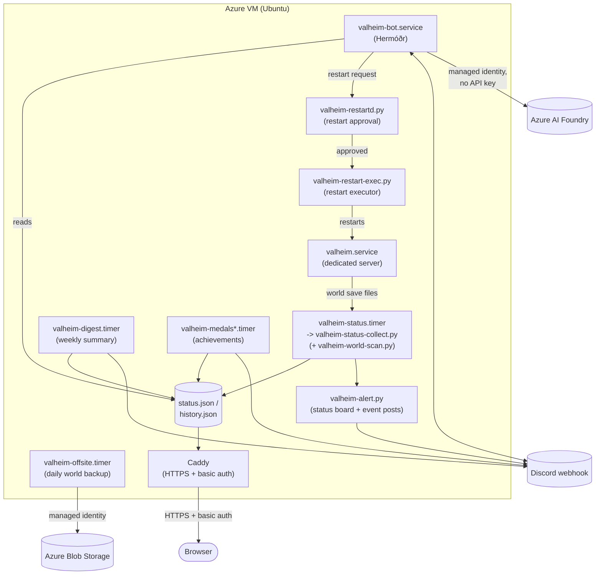

# Valheim Azure Server

Infrastructure-as-code and operational tooling for running a self-hosted [Valheim](https://www.valheim.com/)
dedicated server on a single Azure VM, with a live status dashboard, Discord integration, and
automated backups. This is one person's real deployment, published with every credential and
environment-specific identifier stripped out, so you can stand up the same thing for your own
group.

## What this is

- A **Valheim dedicated server** running as a systemd service on an Ubuntu VM, bootstrapped
  entirely from a single `cloud-init.yaml` (packages, `steamcmd`, the server unit, helper
  scripts — re-running it against a fresh VM reproduces the server, minus the world save).
- A **live status dashboard** (`azure/dashboard/index.html`), served over HTTPS with HTTP
  basic auth via [Caddy](https://caddyserver.com/), which gets its own automatic Let's
  Encrypt certificate.
- **Discord alerts**, including a single message that gets edited in place roughly once a
  minute into a continuously-updating live status board (pinned at the top of a channel),
  plus one-off posts for raids, boss kills, milestones, and a weekly digest.
- An **achievements ("medals") system** — about 27 records computed from the same on-disk
  telemetry everything else uses, posted live when broken, summarized daily, and rolled into
  the weekly digest and a pinned Hall of Fame board.
- **Hermóðr**, a Discord bot that answers questions about the server (who's online, boss
  progress, per-player stats, how a given medal is calculated) using an LLM, scoped to a
  single allow-listed channel and authenticated to Azure with no stored API key.
- A **Discord restart-approval flow** (`valheim-restartd.py`, `valheim-restart-exec.py`, and
  their systemd units) that lets the Discord community approve a server restart from chat,
  gated to a specific guild and an approver role. The bot no longer runs as root. Advanced
  tuning for these two scripts is documented in [`docs/RESTART-TUNING.md`](docs/RESTART-TUNING.md).
- **Daily off-site world backups** to Azure Blob Storage, independent of the local snapshot
  directory on the VM, with a 30-day retention lifecycle.
- An **auto-updater** that checks Steam for a new build every 30 minutes and only restarts
  the server when nobody is connected — it never force-restarts players out of the game.

Full operational detail — the exact file layout, every systemd unit, troubleshooting
commands, and a security-relevant changelog from the original deployment — lives in
[`docs/OPERATIONS.md`](docs/OPERATIONS.md). Read this file first; that one is the reference
you'll come back to once the server is running.

**This repository ships no world saves and no player data.** Every world file, save
archive, and player-identifying value that existed in the original deployment has been
excluded or redacted before publishing.

## The dashboard

The dashboard (`azure/dashboard/index.html`, fed by `azure/dashboard/valheim-status-collect.py`
running once a minute) is a single static page with no backend framework — it polls a JSON
file that the collector writes. What it shows:

- **Who's online right now**, with session length and a live ping figure — measured by
  sniffing a few seconds of UDP traffic on the game port to learn each connected player's
  address (never stored beyond the pairing), then ICMP-pinging it directly from the VM,
  since the dedicated server binary doesn't expose in-game ping itself.
- **24-hour and 7-day player charts**, a per-player ping history chart, and a weekday/hour
  heat map of when the world tends to be busy.
- **In-game day, boss progression, and built-object counts — read directly out of the world
  save**, not tracked separately. This is the most technically interesting part of the
  project: Valheim's save format isn't public, so the collector parses it directly.
  `*_main.*.db2` starts with a version, a `netTime` double (used to derive the in-game day),
  then a gzip stream; boss kills are detected by searching the decompressed block for known
  global-key strings (`defeated_eikthyr` and friends). Structure counts come from the raw
  `*.chunk` files: each is a flat array of ZDO (Zone Data Object) records — position as three
  float32s immediately followed by a uint32 **stable hash of the prefab name** — so counting
  occurrences of a given prefab's hash across every chunk file yields a live count of how
  many of that object exist in the world, with no game-side API involved. `azure/dashboard/valheim-world-scan.py`
  documents the reverse-engineered record layout in detail, including how it was verified
  (byte-exact parsing of a small chunk file, cross-checked against a tombstone's own
  in-object position field).
- **A world map**, scattered from the same ZDO records — every parsed object becomes a point,
  positioned by its stored x/z coordinates against the world's playable radius.
- **Per-player tables**: this session, average session, session count, total time, last
  seen.
- **Uptime and update history** — when the server last restarted, why (manual, crash, or an
  auto-update), and the last several Steam builds it moved through.

## Architecture



## Deploy your own

The game server is required; everything else here is optional and layered on top of it.

1. **Create the VM.** Provision an Azure VM (the original deployment used
   `Standard_D2as_v7`, 2 vCPU / 8 GB, Ubuntu 22.04 LTS) with `azure/cloud-init.yaml` as its
   custom data / cloud-init user data. This installs `steamcmd`, pulls the Valheim
   dedicated server (Steam app id `896660`), and creates the `valheim` systemd service and
   the 30-minute auto-update timer.
2. **Edit the values that are hardcoded, not templated.** This repo is published as a real
   (redacted) deployment, not a parameterized template — a handful of values are baked
   directly into files rather than read from environment variables, and you need to change
   them before you deploy:
   - The server name, world name, and join password on the `ExecStart=` line of the
     `valheim.service` unit in `azure/cloud-init.yaml`.
   - The admin Steam64 ID seeded into `adminlist.txt`, also in `azure/cloud-init.yaml`.
   - The dashboard hostname on the site block at the top of `azure/dashboard/Caddyfile`
     (only needed if you're deploying the dashboard).
   - The storage account name near the top of `azure/dashboard/valheim-offsite-backup.sh`
     (only needed if you want off-site backups).
3. **Open the network you need.** UDP 2456-2458 for the game itself. TCP 80/443 only if
   you're deploying the dashboard (Caddy needs them for HTTP-01 Let's Encrypt validation and
   HTTPS). Leave inbound TCP 22 (SSH) closed — see Security model below.
4. **Point DNS at the VM's public IP** if you're deploying the dashboard — an Azure DNS
   label on the public IP resource works well and gives you a stable hostname without
   registering a domain.
5. **Deploy the dashboard (optional).** Copy `azure/dashboard/` to the VM and run
   `sudo bash install-dashboard.sh <viewer-password> <owner-password>` as root. This
   installs Caddy, the collector, the alert/digest/medals scripts and their timers, and
   Hermóðr's virtualenv — but does not enable Hermóðr itself (see next step).
6. **Fill in the secrets file.** Copy `.env.example` (root of this repo) alongside
   `azure/dashboard/valheim-alert.env` (the tracked template) to understand what each
   variable is; then, on the VM, edit the real file at `/etc/valheim-alert.env` (created by
   the installer, mode `0600`, root-only) with your actual Discord webhook URL and, if you
   want Hermóðr, your bot token and channel id.
7. **Enable what you want running.** `valheim-status.timer` (required for the dashboard) and
   `caddy` are enabled by the installer already. Enable `valheim-offsite.timer` if you want
   off-site backups, `valheim-digest.timer` / `valheim-medals-daily.timer` for the weekly
   digest and daily achievements post, and `sudo systemctl enable --now valheim-bot` once
   `/etc/valheim-alert.env` has a real Discord bot token — Hermóðr also needs an Azure AI
   Foundry deployment reachable by the VM's managed identity (`HERMODR_AI_ENDPOINT`).
8. **Verify.** `docs/OPERATIONS.md` has the full command reference for checking each piece
   (`systemctl status valheim`, the dashboard's own health, timer status, log locations).

## Cost

Figures from the original 24x7 deployment in `West US 2`, as a rough guide — actual pricing
varies by region and changes over time, so check the Azure Pricing Calculator for current
numbers:

| Item | Approx. cost |
|---|---|
| VM (`Standard_D2as_v7`, running continuously) | ~$66/month |
| OS disk (30 GB Standard SSD) | ~$2.40/month |
| Static public IP | ~$3.65/month |
| **Total, running 24x7** | **~$72/month** |
| Same VM, deallocated (stopped) | ~$6/month |
| Off-site world backups (Blob Storage, Cool tier, 30-day retention) | well under $0.05/month |

The original deployment ran on a Visual Studio Enterprise (MSDN) subscription with a
~$150/month Azure credit and a spending limit, which simply pauses the subscription rather
than billing overage if the credit runs out in a given month — a pay-as-you-go subscription
works too, just set a budget alert (`az consumption budget create`, see
`docs/OPERATIONS.md`) if you want a warning before you'd be billed.

## Security model

- **SSH is closed to the internet.** The VM's network security group has no inbound rule for
  TCP 22 at all; administration happens over a private [Tailscale](https://tailscale.com/)
  network instead. A public "allow my IP" rule was deliberately rejected — on a connection
  with a rotating or shared (CGNAT) egress address, an IP allow-rule is both fragile and
  looser than it looks. A break-glass path (`az vm run-command invoke`, or the Azure Serial
  Console) exists for the case where Tailscale itself is unreachable.
- **The dashboard sits behind HTTP basic auth**, served over HTTPS with an automatically
  renewed Let's Encrypt certificate. Two separate logins are used: one for the dashboard
  itself, a second, different one for the world-backup download listing — so a viewer login
  shared with friends can't be used to pull raw world archives.
- **Secrets live only in a root-only environment file on the VM** (`/etc/valheim-alert.env`,
  mode `0600`), never in this repository. The template committed here
  (`azure/dashboard/valheim-alert.env`) has every value blank.
- **Hermóðr authenticates to Azure AI with no API key stored anywhere** — it uses the VM's
  system-assigned managed identity against an Azure AI Foundry endpoint. There is no
  long-lived credential to leak, rotate, or accidentally commit; access is entirely governed
  by Azure RBAC on the managed identity. This is the security property in this repo worth
  calling out specifically — it removes an entire class of "the API key ended up in a log
  file" incident by construction.

## Credits / prerequisites

This repository is tooling around, not a replacement for, the official **Valheim Dedicated
Server** — that software is built and published by [Iron Gate AB](https://www.iron-gate-studio.com/),
distributed through Steam. This repo deliberately does **not** redistribute Iron Gate's
dedicated-server manual or any of Iron Gate's assets. See the official docs before you
deploy:

- [Valheim support / official documentation](https://www.valheim.com/support/)
- The **Valheim Dedicated Server** tool page on Steam (search "Valheim Dedicated Server" in
  Steam's Tools library)

You'll also want accounts/access for whichever of the optional pieces you use: an Azure
subscription, a Discord server (for alerts and Hermóðr), and — only for Hermóðr — an Azure AI
Foundry model deployment.

## Contributing

Contributions are welcome. Before your first commit, enable the repo's secret-scan hook so a
real credential can never slip into a commit:

```bash
git config core.hooksPath .githooks
```

See [`CONTRIBUTING.md`](CONTRIBUTING.md) for the full guide: why this matters, where real
configuration values actually live, how to work on the dashboard locally, and the PR
workflow.

## License

[MIT](LICENSE).
